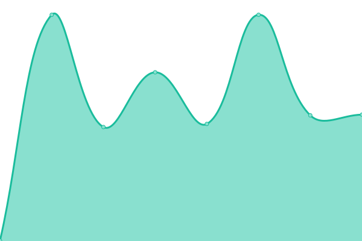
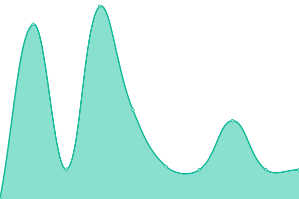

# [📈 Live Status](https://status.inlens.xyz): <!--live status--> **🟧 Partial outage**

This repository contains the open-source uptime monitor and status page for [juancito.eth](https://status.inlens.xyz), powered by [Upptime](https://github.com/upptime/upptime).

With [Upptime](https://upptime.js.org), you can get your own unlimited and free uptime monitor and status page, powered entirely by a GitHub repository. We use [Issues](https://github.com/0xJuancito/inlens-upptime/issues) as incident reports, [Actions](https://github.com/0xJuancito/inlens-upptime/actions) as uptime monitors, and [Pages](https://status.inlens.xyz) for the status page.

<!--start: status pages-->
<!-- This summary is generated by Upptime (https://github.com/upptime/upptime) -->
<!-- Do not edit this manually, your changes will be overwritten -->
<!-- prettier-ignore -->
| URL | Status | History | Response Time | Uptime |
| --- | ------ | ------- | ------------- | ------ |
|  [Inlens Website](http://inlens.xyz) | 🟩 Up | [inlens-website.yml](https://github.com/0xJuancito/inlens-upptime/commits/HEAD/history/inlens-website.yml) | 

 1102ms
     
 | 

<a href="https://status.inlens.xyz/history/inlens-website">99.69%</a>
    

|  Inlens API | 🟩 Up | [inlens-api.yml](https://github.com/0xJuancito/inlens-upptime/commits/HEAD/history/inlens-api.yml) | 

 2377ms
     
 | 

<a href="https://status.inlens.xyz/history/inlens-api">100.00%</a>
    

|  [Lens Protocol API](https://api.lens.dev) | 🟩 Up | [lens-protocol-api.yml](https://github.com/0xJuancito/inlens-upptime/commits/HEAD/history/lens-protocol-api.yml) | 

 482ms
     
 | 

<a href="https://status.inlens.xyz/history/lens-protocol-api">100.00%</a>
    

|  [Twitter API](https://twitter.com/i/oauth2/authorize) | 🟥 Down | [twitter-api.yml](https://github.com/0xJuancito/inlens-upptime/commits/HEAD/history/twitter-api.yml) | 

 347ms
     
 | 

<a href="https://status.inlens.xyz/history/twitter-api">100.00%</a>
    

<!--end: status pages-->

[**Visit our status website →**](https://status.inlens.xyz)

## 📄 License

- Powered by: [Upptime](https://github.com/upptime/upptime)
- Code: [MIT](./LICENSE) © [juancito.eth](https://status.inlens.xyz)
- Data in the `./history` directory: [Open Database License](https://opendatacommons.org/licenses/odbl/1-0/)
